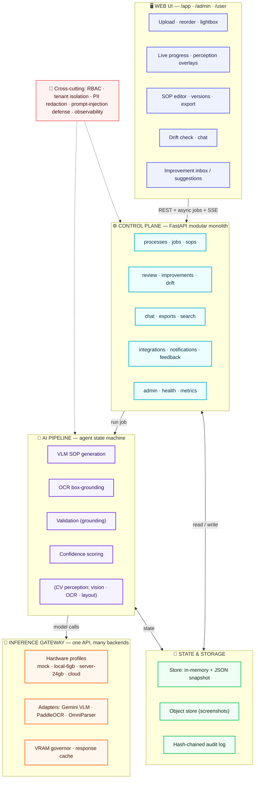
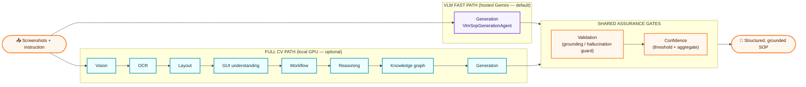
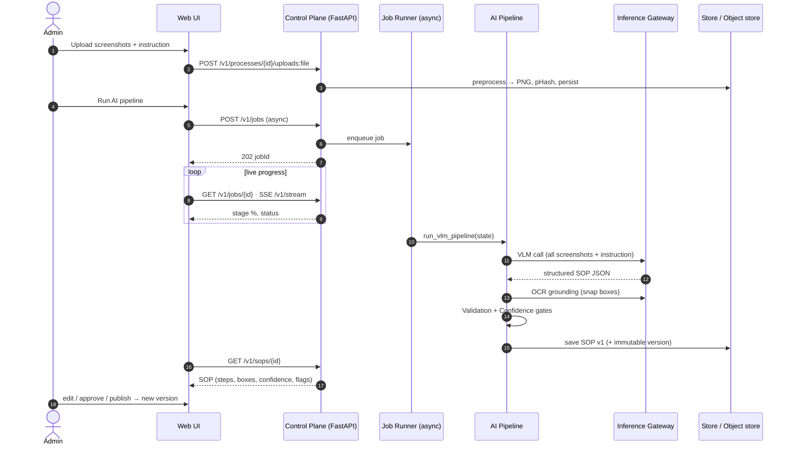
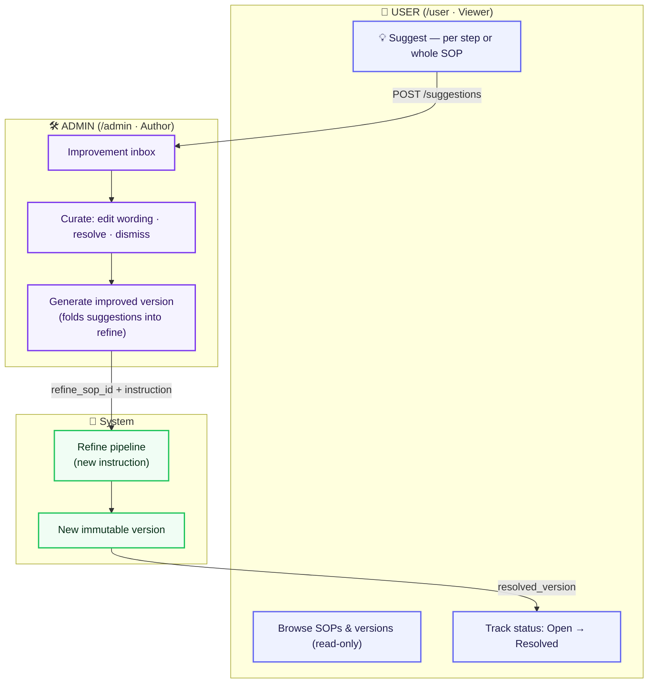
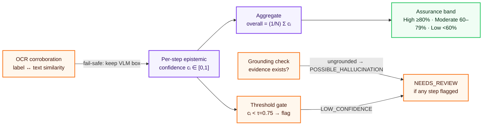
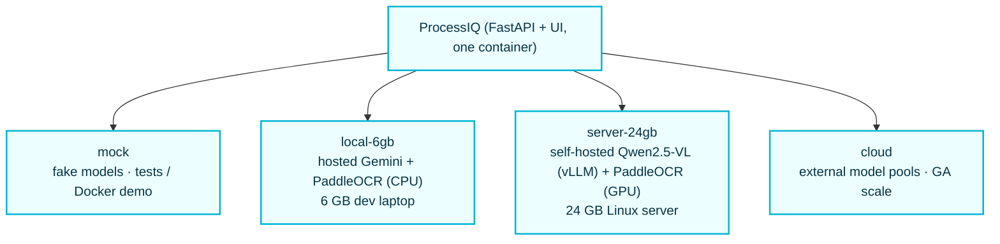
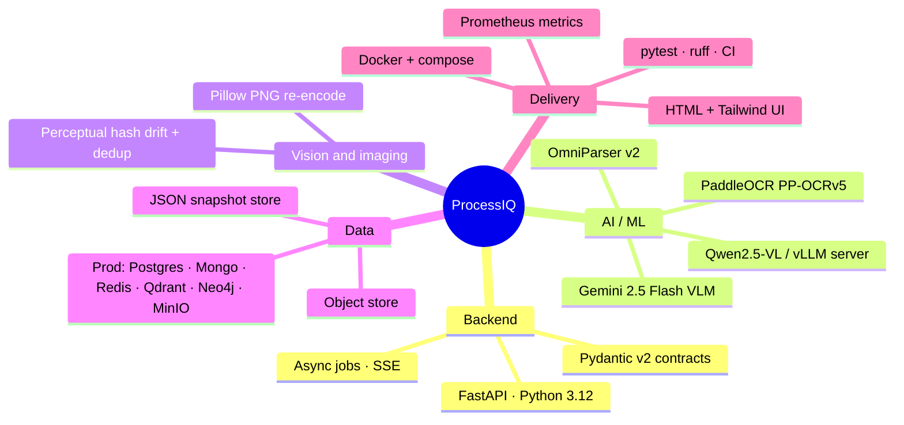

# ProcessIQ — System & Model Architecture

> **How to turn these into an image:** every diagram below is written in **Mermaid**. Paste any block
> into **https://mermaid.live** (Actions → *Export PNG / SVG*), or open this file in VS Code with the
> *Markdown Preview Mermaid* extension, or view it on GitHub (which renders Mermaid inline) and
> screenshot it. All diagrams include a color theme so the exported image looks presentation-ready.

---

## 1. High-level system architecture

Five layers, contract-first (typed Pydantic models) so every box is swappable.

---

## 2. The two generation pipelines

ProcessIQ ships a deterministic, ordered **agent state machine** with two configurations. The **VLM
fast path** (default, hosted Gemini) lets the multimodal model read the screenshots directly and skips
the heavy computer-vision perception stages; the **full CV path** runs local detection/OCR/layout
agents for on-prem GPU deployments. Both end in the same grounding + confidence gates.

---

## 3. End-to-end request flow

From upload to a published SOP, with the async job + streamed progress.

---

## 4. The role-based improvement loop

Readers submit suggestions; authors curate them and regenerate an improved version — the old one is
kept in history. Server-side RBAC enforces the boundary (not just the UI).

---

## 5. Confidence & assurance model

The **CONFIDENCE SCORE** is a multi-signal, evidence-anchored reliability index — not a black-box
number.

---

## 6. Deployment & hardware profiles

The **same code** runs from a laptop to a GPU server; `MODEL_PROFILE` selects the backend.

---

## 7. Component reference

| Layer | Component | Responsibility |
| --- | --- | --- |
| **Web UI** | `apps/api/static/` (HTML + Tailwind + vanilla JS) | upload, live progress, perception overlays, SOP editor, versions, drift, chat, improvement inbox / suggestions |
| **Control plane** | `apps/api/` (FastAPI) | 14 routers: processes · jobs · sops · review · improvements · drift · chat · exports · search · integrations · notifications · feedback · admin · health |
| **Security & governance** | `security_ctx.py`, `audit.py`, `processiq_shared/security.py` | RBAC per action, tenant scoping, PII redaction, prompt-injection defense, SHA-256 hash-chained audit |
| **Orchestrator** | `apps/orchestrator/graph.py` | ordered agent state machine (`run_pipeline` / `run_vlm_pipeline`) with progress callbacks |
| **AI agents** | `agents/` | `sop_vlm` (VLM generation + OCR grounding), `perception` (vision/OCR/layout/GUI), `reasoning` (workflow/knowledge-graph), `generation` (validation/confidence) |
| **Inference gateway** | `apps/inference_gateway/` | profiles, adapters (Gemini VLM, PaddleOCR, OmniParser), VRAM governor, response cache |
| **State & storage** | `store.py`, `objstore.py` | durable in-memory + atomic JSON snapshot (`data/store.json`); on-disk screenshot object store; immutable SOP versions |
| **Contracts** | `processiq_shared/` | Pydantic v2 models, agent state, enums, events — one typed source of truth across API + agents |
| **Exports** | `services/export.py` | PDF · HTML · DOCX · Markdown · JSON · XML · BPMN · test cases · RPA — with embedded, annotated screenshots |

---

## 8. Technology at a glance

---

ProcessIQ — See it. Understand it. Document it. Improve it. — all with agentic AI.

